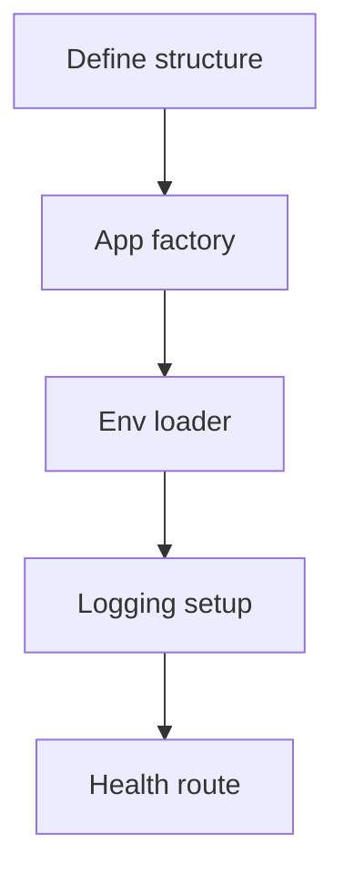

# US-001: Core Scaffolding & Configuration

- Priority: P0 (Critical)
- Effort: 3 days (approx. 24h)
- Status: Not started
- Completion: 0%

## Description
Set up the initial project structure aligned with IAM-gateway: `core/` (app, config, models, routes, services, utils), logging to `logs/`, environment management via `.env` and load order, base Flask app factory. Prepare pyproject and initial dependencies skeleton without pinning versions yet (subject to approval).

## Acceptance Criteria
- App factory loads config from environment with safe defaults.
- Structured logging configured and writing to logs/ with rotation.
- Project directories created: core/, logs/, documentation/ retained.
- `.env` referenced and `.gitignore` excludes it.
- Basic health endpoint working.

## Tasks Checklist
- [ ] TASK-001-01: Define project folders and app factory (Effort: 6h)
- [ ] TASK-001-02: Configure environment loader and `.gitignore` (Effort: 2h)
- [ ] TASK-001-03: Initialize logging with rotating file handler (Effort: 4h)
- [ ] TASK-001-04: Add base config classes (Dev/Staging/Prod) (Effort: 4h)
- [ ] TASK-001-05: Health check route and smoke test (Effort: 2h)

## Mermaid Workflow

