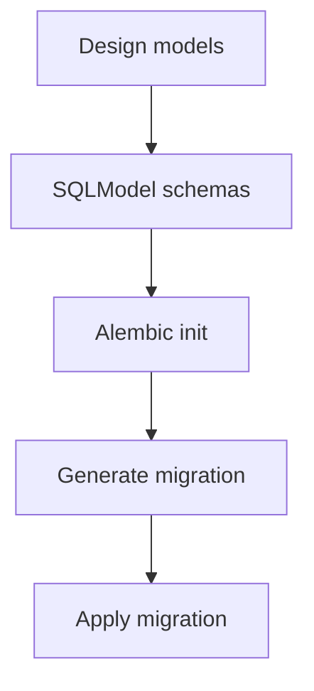

# US-002: Database Models & Migrations

- Priority: P0 (Critical)
- Effort: 2 days (approx. 16h)
- Status: Completed
- Completion: 100%

## Description
Create SQLModel models for `User`, `File`, and `AuditLog`. Configure PostgreSQL connection and Alembic migrations.

## Acceptance Criteria
- SQLModel models defined with constraints and indexes.
- Alembic initialized with autogenerate configured.
- Initial migration creates tables and is applied successfully.

## Tasks Checklist
- [x] TASK-002-01: Define `User` model (email, api_key, status, timestamps) (Effort: 4h)
- [x] TASK-002-02: Define `File` model (cid, user_id, pin_status, timestamps) (Effort: 3h)
- [x] TASK-002-03: Define `AuditLog` model (user_id, action, details, ts) (Effort: 3h)
- [x] TASK-002-04: Configure Alembic and initial migration (Effort: 6h)

## Mermaid Workflow

