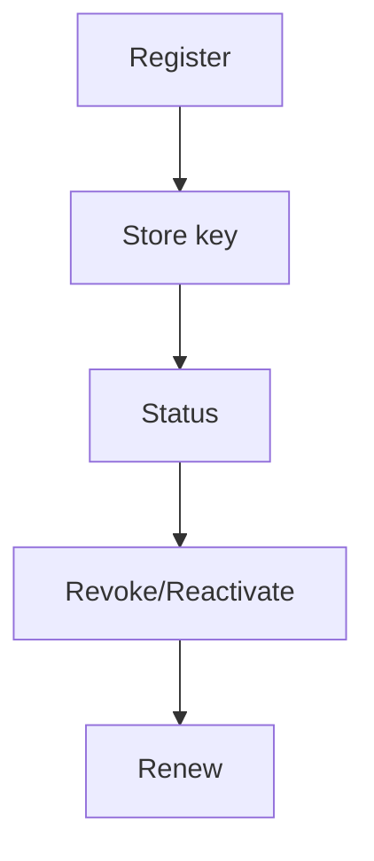

# US-003: Authentication & API Key Management

- Priority: P0 (Critical)
- Effort: 3 days (approx. 24h)
- Status: Not started
- Completion: 0%

## Description
Implement endpoints: POST /register, POST /status, POST /revoke, POST /reactivate, POST /renew. Enforce admin-only actions where required.

## Acceptance Criteria
- API key securely generated and stored.
- Admin-only actions gated by admin API key.
- Consistent response schema with errors standardized.

## Tasks Checklist
- [ ] TASK-003-01: API key generator & secure storage strategy (Effort: 6h)
- [ ] TASK-003-02: Implement /register and /status (Effort: 6h)
- [ ] TASK-003-03: Implement /revoke and /reactivate (admin) (Effort: 6h)
- [ ] TASK-003-04: Implement /renew (email-based) (Effort: 6h)

## Mermaid Workflow

