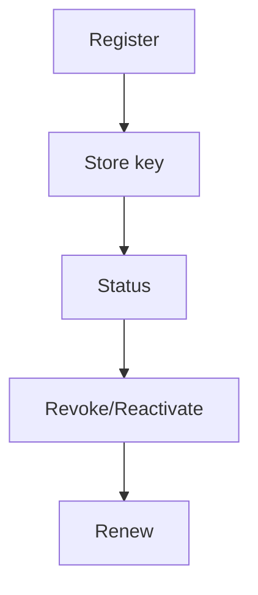

# US-003: Authentication & API Key Management

- Priority: P0 (Critical)
- Effort: 3 days (approx. 24h)
- Status: Completed
- Completion: 100%

## Description
Implement endpoints: POST /register, POST /status, POST /revoke, POST /reactivate, POST /renew. Enforce admin-only actions where required. The admin API key is set via `ADMIN_API_KEY` env var. Use secure random generation for API keys and store hashed in DB.

## Acceptance Criteria
- API key securely generated and stored.
- Admin-only actions gated by admin API key.
- Consistent response schema with errors standardized.

## Tasks Checklist
- [x] TASK-003-01: API key generator & secure storage strategy (Effort: 6h)
- [x] TASK-003-02: Implement /register and /status (Effort: 6h)
- [x] TASK-003-03: Implement /revoke and /reactivate (admin) (Effort: 6h)
- [x] TASK-003-04: Implement /renew (email-based) (Effort: 6h)

## Notes
- Implemented salted PBKDF2-HMAC SHA-256 storage with per-user salt (`api_key_salt`).
- Added decorators `require_api_key` and `require_admin_key` for route protection.
- Endpoints implemented in `core/routes/auth.py`; service logic in `core/services/auth_service.py`.
- Alembic migrations generated and applied (`e1304f2542e0_add_api_key_salt_to_users`).
- Tests: unit (service), API, and integration using in-memory SQLite; all passing.

## Mermaid Workflow

