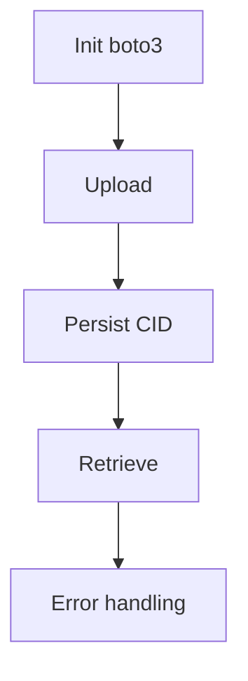

# US-004: IPFS Integration via Filebase (S3 API)

- Priority: P0 (Critical)
- Effort: 3 days (approx. 24h)
- Status: Completed ✅
- Completion: 100%

## Description
Use `boto3` with Filebase S3-compatible API leveraging `FILEBASE_IPFS_API_KEY` to upload and retrieve content. Persist CID and metadata.

## Acceptance Criteria
- ✅ Upload returns CID and persists `File` record with original_filename and mime_type
- ✅ Retrieve by CID streams content with correct Content-Type
- ✅ Errors from Filebase mapped to standardized API errors
- ✅ Exponential backoff retries (tenacity) with 3 attempts, 2-10s intervals
- ✅ Circuit breaker pattern (pybreaker) with fail_max=5, reset_timeout=60s
- ✅ @require_api_key decorator enforces authentication on both endpoints
- ✅ AuditLog entries created for all upload/retrieve operations

## Tasks Checklist
- [x] TASK-004-01: Configure boto3 client with Filebase credentials
- [x] TASK-004-02: Implement /upload with CID persistence
- [x] TASK-004-03: Implement /retrieve/<cid> streaming
- [x] TASK-004-04: Error mapping & retries with circuit breaker
- [x] TASK-004-05: Alembic migration for File model columns
- [x] TASK-004-06: Unit tests for filebase_service (9 tests passing)
- [x] TASK-004-07: AuditLog integration for upload/retrieve

## Mermaid Workflow

