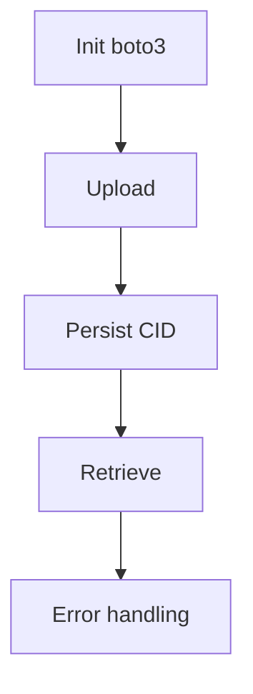

# US-004: IPFS Integration via Filebase (S3 API)

- Priority: P0 (Critical)
- Effort: 3 days (approx. 24h)
- Status: Not started
- Completion: 0%

## Description
Use `boto3` with Filebase S3-compatible API leveraging `FILEBASE_IPFS_API_KEY` to upload and retrieve content. Persist CID and metadata.

## Acceptance Criteria
- Upload returns CID and persists `File` record.
- Retrieve by CID streams content.
- Errors from Filebase mapped to standardized API errors.

## Tasks Checklist
- [ ] TASK-004-01: Configure boto3 client with Filebase credentials (Effort: 4h)
- [ ] TASK-004-02: Implement /upload with CID persistence (Effort: 10h)
- [ ] TASK-004-03: Implement /retrieve/<cid> streaming (Effort: 6h)
- [ ] TASK-004-04: Error mapping & retries (Effort: 4h)

## Mermaid Workflow

