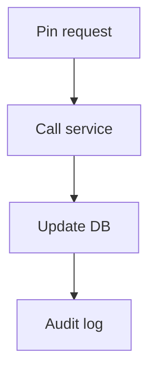

# US-005: Content Pinning & Management

- Priority: P1 (High)
- Effort: 2 days (approx. 16h)
- Status: In Progress
- Completion: 100%

## Description
Implement pin/unpin endpoints backed by Filebase/IPFS pinning service where applicable. Persist pin status and audit actions.

## Acceptance Criteria
- POST /pin/<cid> and POST /unpin/<cid> implemented. ✓
- Pin status tracked in DB. ✓
- Audit log created for pin/unpin operations. ✓

## Tasks Checklist
- [x] TASK-005-01: Pin/unpin service integration abstraction (Effort: 6h)
- [x] TASK-005-02: Implement endpoints & DB updates (Effort: 6h)
- [x] TASK-005-03: Audit log entries for actions (Effort: 4h)

## Mermaid Workflow

