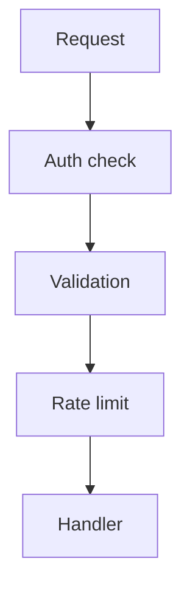

# US-006: Security, Validation & Rate Limiting

- Priority: P0 (Critical)
- Effort: 2 days (approx. 16h)
- Status: Not started
- Completion: 0%

## Description
Enforce API key auth on all endpoints, implement input validation, and rate limiting to prevent abuse. Ensure HTTPS-only in GAE.

## Acceptance Criteria
- Middleware validates API key for requests.
- Input payloads validated with clear error messages.
- Rate limiting active with configurable thresholds.

## Tasks Checklist
- [ ] TASK-006-01: Auth middleware & admin gating (Effort: 6h)
- [ ] TASK-006-02: Input validation schemas (Effort: 6h)
- [ ] TASK-006-03: Rate limiting integration (Effort: 4h)

## Mermaid Workflow

