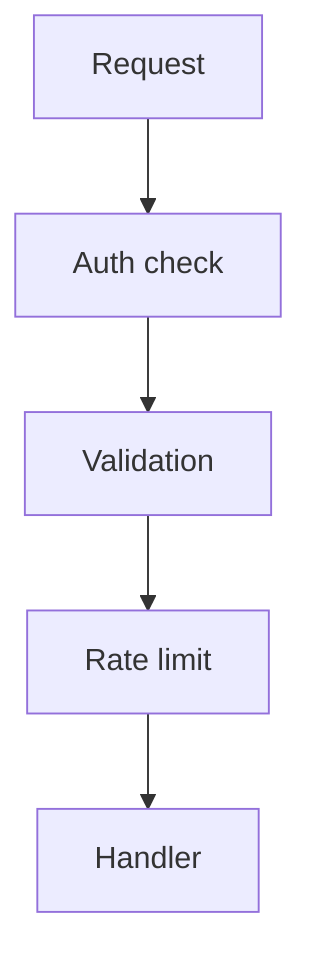

# US-006: Security, Validation & Rate Limiting

- Priority: P0 (Critical)
- Effort: 2 days (approx. 16h)
- Status: Completed
- Completion: 100%

## Description
Enforce API key auth on all endpoints and retrieval of resources limited to their owner, implement input validation, and rate limiting to prevent abuse. For standard users, the uploads should be limited to a maximum of 15 per month, any other action doesn´t have quota. Ensure HTTPS-only in GAE.

## Acceptance Criteria
- Middleware validates API key for requests. ✓
- Input payloads validated with clear error messages. ✓
- Rate limiting active with configurable thresholds. ✓
- File ownership enforced (404 if not owner, admins can access all). ✓
- File size limit 3MB enforced. ✓
- Rate limit headers returned (X-RateLimit-Limit, Remaining, Reset). ✓
- Standard users limited to 15 uploads/month with calendar reset. ✓

## Tasks Checklist
- [x] TASK-006-01: Auth middleware & admin gating (Effort: 6h)
- [x] TASK-006-02: Input validation schemas (Effort: 6h)
- [x] TASK-006-03: Rate limiting integration (Effort: 4h)

## Mermaid Workflow

