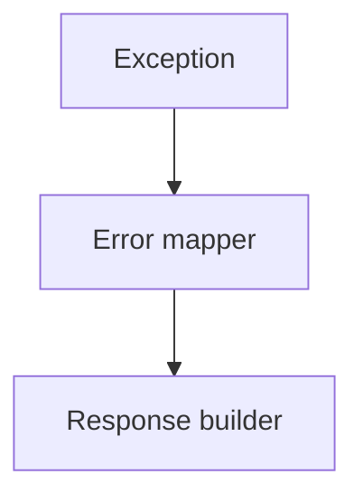

# US-007: Standardized Error Handling

- Priority: P1 (High)
- Effort: 1 day (approx. 8h)
- Status: Completed
- Completion: 100%

## Description
Create global error handlers and standardized response schema with consistent status codes and messages.

## Acceptance Criteria
- ✅ Consistent error response format across all endpoints.
- ✅ Mapped exceptions for common failures (auth, validation, IPFS, DB).

## Tasks Checklist
- ✅ TASK-007-01: Global error handlers (Effort: 4h) - Completed
- ✅ TASK-007-02: Response schemas & helpers (Effort: 4h) - Completed

## Implementation Summary
Created a centralized error handling system with:
- `ErrorResponses` class with standardized error methods
- `error_response()` helper function for flexible error formatting
- Consistent error format: `{"error": "code", "message": "...", "details": "..."}`
- Updated all routes (auth, upload) and decorators to use standardized responses
- All 39 tests passing, 1 skipped

## Files Changed
- `core/utils/errors.py` (new file)
- `core/routes/auth.py`
- `core/routes/upload.py`
- `core/utils/decorators.py`
- `tasks/TASK-007-01.md`
- `tasks/TASK-007-02.md`

## Mermaid Workflow

