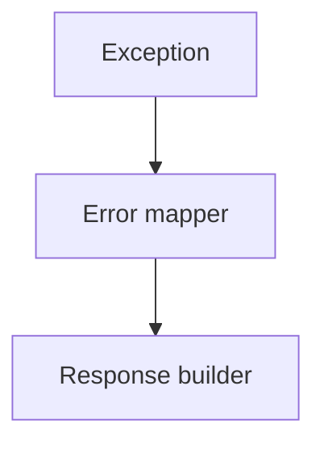

# US-007: Standardized Error Handling

- Priority: P1 (High)
- Effort: 1 day (approx. 8h)
- Status: Not started
- Completion: 0%

## Description
Create global error handlers and standardized response schema with consistent status codes and messages.

## Acceptance Criteria
- Consistent error response format across all endpoints.
- Mapped exceptions for common failures (auth, validation, IPFS, DB).

## Tasks Checklist
- [ ] TASK-007-01: Global error handlers (Effort: 4h)
- [ ] TASK-007-02: Response schemas & helpers (Effort: 4h)

## Mermaid Workflow

