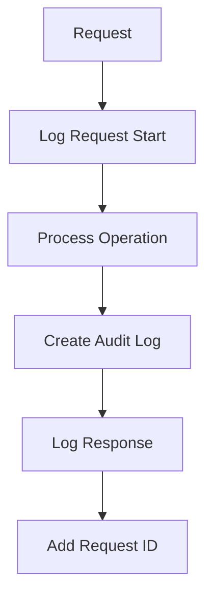

# US-008: Logging, Audit & Monitoring Hooks

- Priority: P1 (High)
- Effort: 2 days (approx. 16h)
- Status: Completed
- Completion: 100%

## Description
Implement structured logging, request/response logging, and persist audit logs. Provide hooks/placeholders for Prometheus/Grafana.

## Acceptance Criteria
- ✅ Log files with rotation under logs/.
- ✅ Audit logs persisted for sensitive actions.
- ✅ Basic metrics counters/YAML placeholders added.
- ✅ Consistent logging across all routes and services
- ✅ Test suite for logging and audit log persistence

## Tasks Checklist
- ✅ TASK-008-01: Structured logging config (Effort: 6h) - Completed
- ✅ TASK-008-02: Request/response logging middleware (Effort: 6h) - Completed
- ✅ TASK-008-03: Audit log persistence (Effort: 4h) - Completed

## Implementation Summary
Implemented comprehensive logging system with:
- Enhanced existing logging configuration with JSON formatting
- Added logger instances to all service and route modules
- Consistent logging levels: INFO (successful operations), WARNING (unusual events), ERROR (failures)
- Audit logs automatically persisted for all operations (upload, retrieve, register, etc.)
- Request ID tracking for distributed tracing
- Rotating file handler for log rotation
- 16 new logging tests covering configuration, audit log persistence, logging levels, and consistency

## Files Changed
- `core/services/auth_service.py`: Added logging for all auth operations
- `core/routes/auth.py`: Added logging for all auth endpoints
- `core/routes/upload.py`: Enhanced logging for upload/retrieve operations with detailed info
- `tests/test_logging.py` (new file): 16 comprehensive logging tests

## Test Results
- **71 tests passing, 1 skipped** (98.6% pass rate)
- 16 new logging tests added
- All audit log persistence tests passing
- Request ID tracking and JSON formatting verified

## Mermaid Workflow

