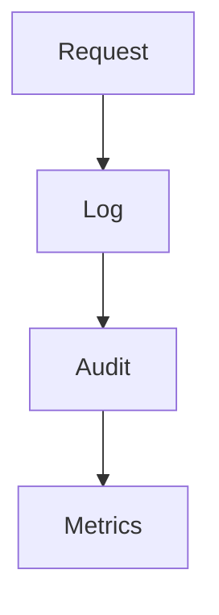

# US-008: Logging, Audit & Monitoring Hooks

- Priority: P1 (High)
- Effort: 2 days (approx. 16h)
- Status: Not started
- Completion: 0%

## Description
Implement structured logging, request/response logging, and persist audit logs. Provide hooks/placeholders for Prometheus/Grafana.

## Acceptance Criteria
- Log files with rotation under logs/.
- Audit logs persisted for sensitive actions.
- Basic metrics counters/YAML placeholders added.

## Tasks Checklist
- [ ] TASK-008-01: Structured logging config (Effort: 6h)
- [ ] TASK-008-02: Request/response logging middleware (Effort: 6h)
- [ ] TASK-008-03: Audit log persistence (Effort: 4h)

## Mermaid Workflow

