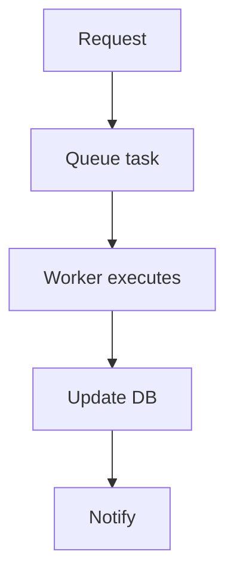

# US-009: Asynchronous Tasks (Celery + Redis)

- Priority: P1 (High)
- Effort: 3 days (approx. 24h)
- Status: Not started
- Completion: 0%

## Description
Configure Celery with Redis to offload heavy operations (uploads, pinning) and add retries/backoff.

## Acceptance Criteria
- Celery worker and beat configured.
- Tasks implemented for upload/pin workflows.
- Retry policies set and observable.

## Tasks Checklist
- [ ] TASK-009-01: Celery/Redis configuration (Effort: 8h)
- [ ] TASK-009-02: Implement async upload task (Effort: 8h)
- [ ] TASK-009-03: Implement async pin task & retries (Effort: 8h)

## Mermaid Workflow

