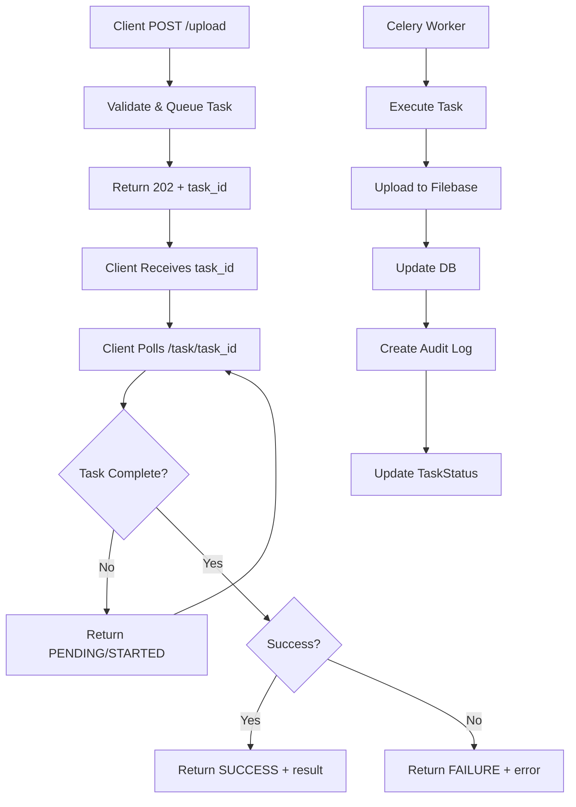

# US-009: Asynchronous Tasks (Celery + Redis)

- Priority: P1 (High)
- Effort: 3 days (approx. 24h)
- Status: ✅ Completed
- Completion: 100%

## Description
Configure Celery with Redis to offload heavy operations (uploads, pinning) and add retries/backoff.

## Acceptance Criteria
- ✅ Celery worker and beat configured and running
- ✅ Tasks implemented for upload/pin workflows with Option A (task-based polling)
- ✅ Retry policies set with exponential backoff (3 attempts, 60s base × 2^retries)
- ✅ TaskStatus model tracking async operations
- ✅ Comprehensive test suite with 8 async tests
- ✅ All 79 tests passing (1 skipped)

## Tasks Checklist
- [x] TASK-009-01: Celery/Redis configuration (Effort: 8h) ✅ Completed
- [x] TASK-009-02: Implement async upload task (Effort: 8h) ✅ Completed
- [x] TASK-009-03: Implement async pin task & retries (Effort: 8h) ✅ Completed

## Implementation Summary

### Infrastructure
- Docker Compose with Redis 7 container (port 6379)
- Celery 5.6.1 with JSON serialization
- Task routing via topic exchanges (upload.*, pin.*)
- Result backend: Redis with 1-hour expiry

### Core Components
- **TaskStatus Model**: Tracks task states (PENDING → STARTED → SUCCESS/FAILURE/RETRY)
- **Async Tasks**:
  - `upload_file_task`: Base64 file encoding, Filebase integration, DB updates, audit logging
  - `pin_content_task`: Pin status tracking with error handling for not-found
  - `unpin_content_task`: Unpin status tracking
- **API Changes**:
  - `/upload` → 202 + task_id (async queued)
  - `/pin/<cid>` → 202 + task_id (async queued)
  - `/unpin/<cid>` → 202 + task_id (async queued)
  - NEW `/task/<task_id>` → Task status polling with authorization

### Testing
- 8 new async-specific tests
- 71 existing tests updated for async behavior
- All 79 tests passing (1 skipped)
- Coverage: Endpoint behavior, task status, model operations

## Architecture: Option A (Task-based Polling)

