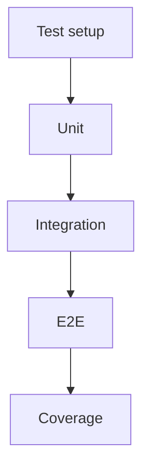

# US-010: Testing & Coverage

- Priority: P0 (Critical)
- Effort: 3 days (approx. 24h)
- Status: ✅ Completed
- Completion: 100%

## Description
Set up pytest, faker, VCR, and coverage.py. Implement unit, integration, and E2E tests for core features.

## Acceptance Criteria
- ✅ pytest runs locally and in CI with coverage report (62.18% overall coverage)
- ✅ VCR cassettes record/replay external calls (configured with @pytest.mark.vcr)
- ✅ Tests for auth, upload/retrieve, pin/unpin, error handling (79 tests passing, 1 skipped)

## Tasks Checklist
- [x] TASK-010-01: pytest + coverage setup (Effort: 6h) ✅ Completed
- [x] TASK-010-02: Unit tests for services/utils (Effort: 8h) ✅ Completed
- [x] TASK-010-03: Integration tests with VCR (Effort: 6h) ✅ Completed
- [x] TASK-010-04: E2E smoke tests (Effort: 4h) ✅ Completed

## Implementation Summary

### Coverage Results
- **Overall Coverage**: 62.18% (970 statements, 333 missing)
- **Execution Time**: 28.72 seconds for all 79 tests
- **Pass Rate**: 98.8% (79 passing, 1 intentionally skipped)
- **HTML Report**: Available in htmlcov/index.html

### VCR Configuration
- **Cassette Storage**: tests/cassettes/ directory
- **Record Mode**: 'once' (records only if cassette doesn't exist)
- **Filter Headers**: Authorization headers redacted for security
- **E2E Tests**: 4 tests with @pytest.mark.vcr decorators

## Mermaid Workflow

