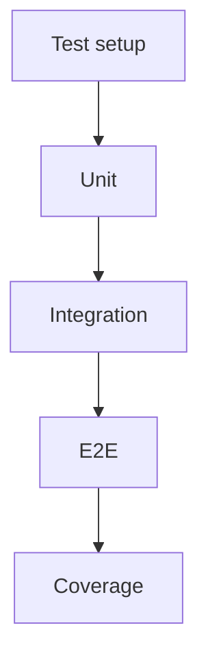

# US-010: Testing & Coverage

- Priority: P0 (Critical)
- Effort: 3 days (approx. 24h)
- Status: Not started
- Completion: 0%

## Description
Set up pytest, faker, VCR, and coverage.py. Implement unit, integration, and E2E tests for core features.

## Acceptance Criteria
- pytest runs locally and in CI with coverage report.
- VCR cassettes record/replay external calls.
- Tests for auth, upload/retrieve, pin/unpin, error handling.

## Tasks Checklist
- [ ] TASK-010-01: pytest + coverage setup (Effort: 6h)
- [ ] TASK-010-02: Unit tests for services/utils (Effort: 8h)
- [ ] TASK-010-03: Integration tests with VCR (Effort: 6h)
- [ ] TASK-010-04: E2E smoke tests (Effort: 4h)

## Mermaid Workflow

