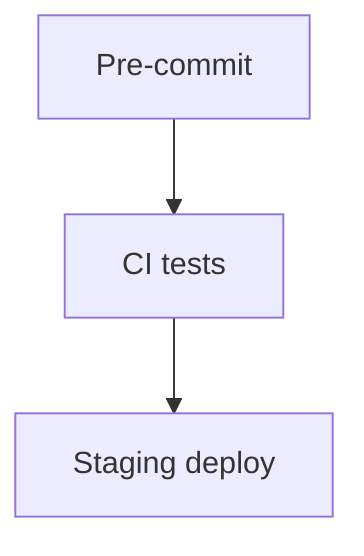

# US-011: CI/CD & Pre-commit

- Priority: P1 (High)
- Effort: 2 days (approx. 16h)
- Status: Not started
- Completion: 0%

## Description
Set up GitHub Actions pipeline to run tests and deploy to staging on merge. Configure `.pre-commit-config.yaml` for linting, security, and docstrings. For security checks, get user approval before enabling.

## Acceptance Criteria
- CI runs on PR with tests and coverage gates.
- Pre-commit hooks enforced locally.
- Staging deployment job defined (GAE later).

## Tasks Checklist
- [ ] TASK-011-01: Configure pre-commit hooks (Effort: 4h)
- [ ] TASK-011-02: GitHub Actions test workflow (Effort: 8h)
- [ ] TASK-011-03: Staging deployment job skeleton (Effort: 4h)

## Mermaid Workflow

