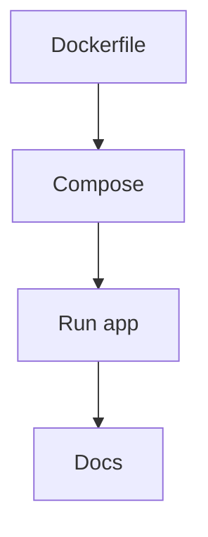

# US-012: Dockerization & Local Dev

- Priority: P2 (Medium)
- Effort: 2 days (approx. 16h)
- Status: Not started
- Completion: 0%

## Description
Create Dockerfile and docker-compose to run the app with PostgreSQL and Redis locally. Document usage.

## Acceptance Criteria
- App builds and runs via Docker.
- Compose starts Postgres and Redis.
- Docs include quickstart commands.

## Tasks Checklist
- [ ] TASK-012-01: Dockerfile for Flask app (Effort: 6h)
- [ ] TASK-012-02: docker-compose for Postgres/Redis (Effort: 6h)
- [ ] TASK-012-03: Local dev docs (Effort: 4h)

## Mermaid Workflow

