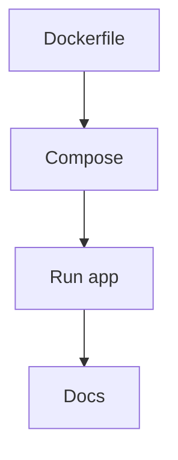

# US-012: Dockerization & Local Dev

- Priority: P2 (Medium)
- Effort: 2 days (approx. 16h)
- Status: Not started
- Completion: 0%

## Description
Create Dockerfile and docker-compose to run the app with PostgreSQL and Redis locally or from the remote production environment. Make sure to structure docker folders as such from the root project IPFS-GATEWAY/:
  
  - docker/dev/ containing:
    - app/ Dockerfile for the Flask application
    - compose/ docker-compose.yaml to set up services (PostgreSQL, Redis, Flask app)
  - docker/prod/ containing:
    - app/ Dockerfile for the Flask application optimized for two type of production servers:
        1. For a remote specific machine using best practices (multi-stage build, smaller base image, etc.) and gunicorn setup with nginx as reverse proxy
        2. For GAE deployment (if different from the dev Dockerfile)
    - compose/ docker-compose.yaml for production-like setup (if needed)

 The image creation of the application should allow the developers to indicate a revision version in the format 1.0.0 (standardized number versioning for application). The image file creation should be done through a shell script that will propose this different menu:
1. define a version number for the application. A version number should be proposed by the CLI according to the choice of the user: major/ minor/ fix. To achieve this it is needed to modify the models of the application and add a APP_VERSION table with the history of the different versions and a status (active, stale)
2. List all the already existing versions of the application
3. Create a new image of the application with the selected version number
4. Start all the services existing in the docker-compose.yaml file
5. Stop all the services existing in the docker-compose.yaml file
6. Add a help section to explain how to use the different commands of the script
Create a documentation file that explains how to use the docker and docker-compose files to run the application locally for development purposes. Add quickstart commands to the README.md.
Create a .dockerignore file to avoid unnecessary files being added to the image.
Create a volume for the database data to persist between container restarts if not already defined.

## Acceptance Criteria
- App builds and runs via Docker.
- Compose starts Postgres and Redis for local development.
- Docs include quickstart commands.

## Tasks Checklist
- [ ] TASK-012-01: Dockerfile for Flask app (Effort: 6h)
- [ ] TASK-012-02: docker-compose for Postgres/Redis (Effort: 6h)
- [ ] TASK-012-03: Local dev docs (Effort: 4h)

## Mermaid Workflow

