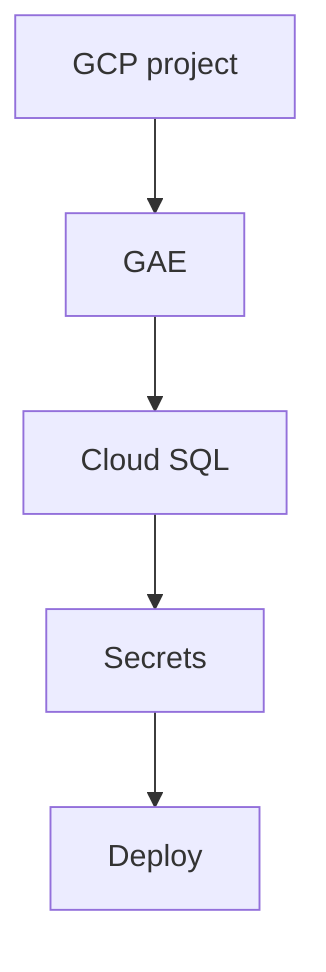

# US-013: GAE Staging Environment Setup

- Priority: P0 (Critical)
- Effort: 3 days (approx. 24h)
- Status: Not started
- Completion: 0%

## Description
Set up GCP project, GAE, Cloud SQL (PostgreSQL), secrets, and deploy staging. You will guide me step by step through the process and provide necessary configuration files and commands to achieve the goals.
Take into account the environment variables needed for the staging environment and how to securely manage them using GCP Secret Manager or other best practices.
Choose the best deployment strategy for GAE (standard vs flexible) based on the app requirements and provide justification for the choice.
Ideally the deployment should be achieved through k8s but if not possible GAE standard is acceptable. Provide the tools for both options.

## Acceptance Criteria
- GCP project created and GAE configured.
- Staging deploy succeeds with environment variables set.

## Tasks Checklist
- [ ] TASK-013-01: Create GCP project & enable APIs (Effort: 6h)
- [ ] TASK-013-02: Configure GAE (app.yaml, service) (Effort: 6h)
- [ ] TASK-013-04: Configure secrets/env for staging (Effort: 6h)

## Mermaid Workflow

