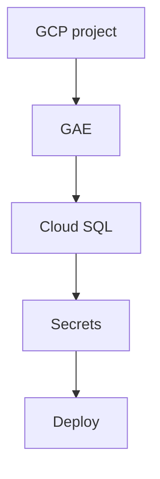

# US-013: GAE Staging Environment Setup

- Priority: P0 (Critical)
- Effort: 3 days (approx. 24h)
- Status: Not started
- Completion: 0%

## Description
Set up GCP project, GAE, Cloud SQL (PostgreSQL), secrets, and deploy staging.

## Acceptance Criteria
- GCP project created and GAE configured.
- Cloud SQL Postgres provisioned and accessible.
- Staging deploy succeeds with environment variables set.

## Tasks Checklist
- [ ] TASK-013-01: Create GCP project & enable APIs (Effort: 6h)
- [ ] TASK-013-02: Configure GAE (app.yaml, service) (Effort: 6h)
- [ ] TASK-013-03: Provision Cloud SQL Postgres (Effort: 6h)
- [ ] TASK-013-04: Configure secrets/env for staging (Effort: 6h)

## Mermaid Workflow

