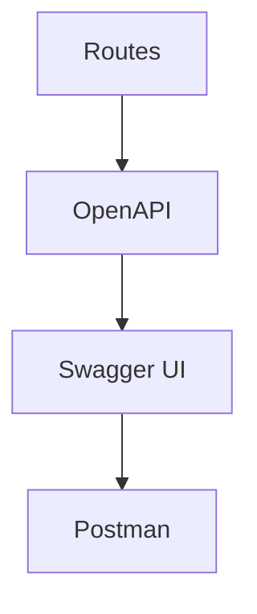

# US-014: API Documentation (OpenAPI/Swagger)

- Priority: P1 (High)
- Effort: 2 days (approx. 16h)
- Status: In Progress
- Completion: 85%

## Description
Provide interactive API documentation (Swagger UI with Flasgger) and Postman collection for easy API exploration and testing.

## Acceptance Criteria
- ✅ OpenAPI spec generated and served via Flasgger
- ✅ Swagger UI accessible in non-production modes (dev/staging)
- ✅ Postman collection exported with environment variables
- ✅ All endpoints documented with examples

## Deliverables

### 1. Swagger/OpenAPI Integration
- **File**: `core/swagger.py` (NEW)
  - Centralized OpenAPI 2.0 specification
  - Flasgger configuration for all environments
  - Endpoint documentation decorators for easy route annotation
  - Accessible at `/api/docs` in dev/staging

### 2. Route Documentation
- **Updated**: `core/routes/health.py`, `core/routes/auth.py`
  - Added YAML docstrings to all endpoints
  - Comprehensive parameter and response documentation
  - Security/auth information included

### 3. Postman Collection
- **File**: `documentation/IPFS_Gateway_API.postman_collection.json` (NEW)
  - 5 major endpoint categories (Auth, Content, Pinning, Health, Docs)
  - Pre-configured variables (base_url, api_key, admin_key, cid)
  - Importable directly into Postman
  - Examples for all major workflows

### 4. API Documentation
- **File**: `documentation/API_DOCUMENTATION.md` (NEW)
  - Complete API reference guide
  - All endpoints with request/response examples
  - Error handling and status codes
  - Complete workflow examples (register → upload → pin → retrieve)
  - Postman setup instructions

## Tasks Checklist
- [x] TASK-014-01: Choose and integrate Swagger tooling (Flasgger)
- [x] TASK-014-02: Generate OpenAPI spec from routes
- [x] TASK-014-03: Publish Postman collection

## Implementation Notes

### Technology Stack
- **Flasgger**: Flask + Swagger integration (OpenAPI 2.0)
- **Format**: YAML docstrings in route functions
- **Environments**: Dev (localhost), Staging (GAE)
- **Production**: Docs not exposed for security

### Key Features
- ✓ Interactive Swagger UI at `/api/docs`
- ✓ OpenAPI JSON spec at `/apispec.json`
- ✓ Auto-generated from route docstrings
- ✓ Full endpoint coverage with examples
- ✓ Security/auth documentation
- ✓ Error code documentation
- ✓ Postman collection with environment variables
- ✓ Complete API reference guide

### Next Steps
- TASK-014-02: Add upload/retrieve routes documentation
- Enhanced examples with actual CIDs
- Optional: Add API key validation to Swagger UI

## References
- [API_DOCUMENTATION.md](../documentation/API_DOCUMENTATION.md)
- [IPFS_Gateway_API.postman_collection.json](../documentation/IPFS_Gateway_API.postman_collection.json)
- [core/swagger.py](../core/swagger.py)

## Mermaid Workflow

