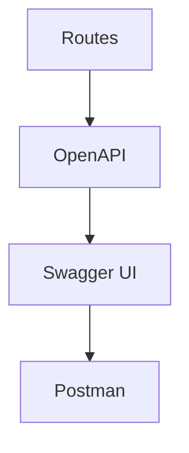

# US-014: API Documentation (OpenAPI/Swagger)

- Priority: P1 (High)
- Effort: 2 days (approx. 16h)
- Status: Not started
- Completion: 0%

## Description
Provide interactive API documentation (Swagger UI or Flasgger) and sample Postman collection.

## Acceptance Criteria
- OpenAPI spec generated and served.
- Swagger UI accessible in non-production modes.
- Postman collection exported.

## Tasks Checklist
- [ ] TASK-014-01: Choose and integrate Swagger tooling (Effort: 6h)
- [ ] TASK-014-02: Generate OpenAPI spec from routes (Effort: 6h)
- [ ] TASK-014-03: Publish Postman collection (Effort: 4h)

## Mermaid Workflow

